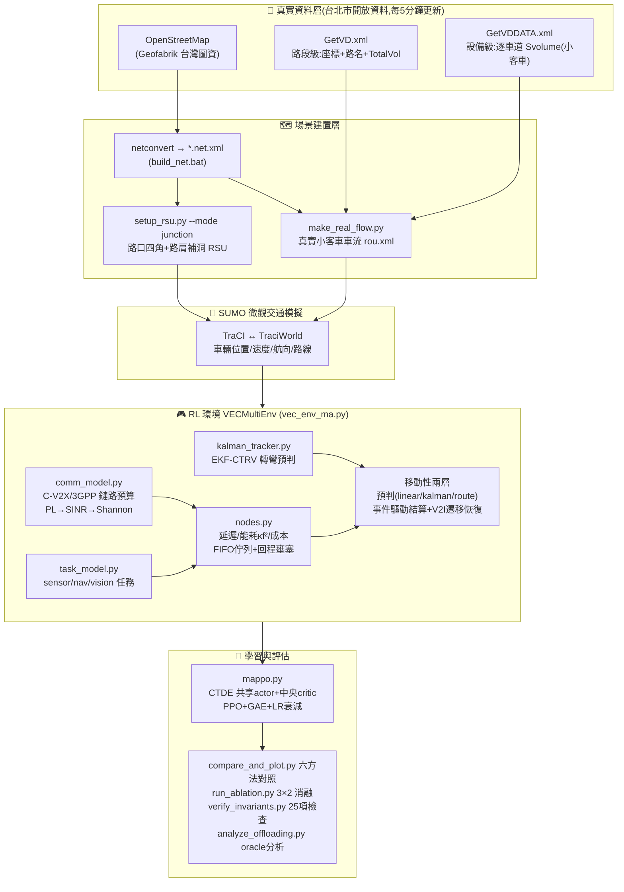
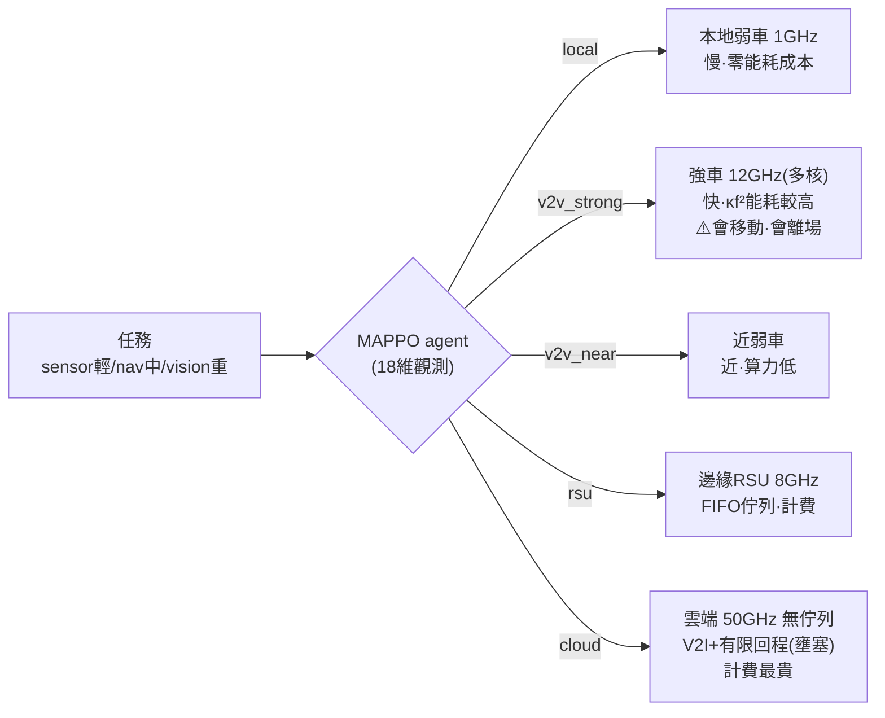
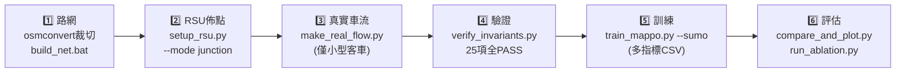

# 數位孿生車聯網運算卸載 — SUMO + 真實台北車流 + MAPPO

以台北市真實路網(和平東路/新生南路)與交控中心即時車流打造數位孿生,
用多智能體強化學習(MAPPO, CTDE)學習「本地 / V2V(強車·近車) / 邊緣 RSU / 雲端」
四層運算卸載決策,在**延遲、能耗、使用成本、deadline、移動性**多重限制下最大化任務成功率。

> 📄 詳細文件:[DT_DEFINITION.md](DT_DEFINITION.md)(**數位孿生定位/保真度/可宣稱邊界**) · [PROGRESS.md](PROGRESS.md)(進度/參數/待辦) · [COMM_MODEL.md](COMM_MODEL.md)(通訊/移動性模型公式與文獻)

---

## 系統架構

### 三層卸載決策(每個任務 5 選 1)

---

## 完整實驗流程

| 步驟 | 指令 | 產出 |
|---|---|---|
| **1. 路網** | 從 [Geofabrik](https://download.geofabrik.de/asia/taiwan.html) 下載 `taiwan-latest.osm.pbf` → `osmconvert taiwan.pbf -b="西,南,東,北" -o=area.osm` → `build_net.bat area.osm` | `*.net.xml` |
| **2. RSU 佈點** | `python setup_rsu.py --net hepingeast2.net.xml --mode junction --corners 2 --plot` | `rsu.add.xml`、`rsu_positions.json`、佈點圖 |
| **3. 真實車流** | `python make_real_flow.py --net hepingeast2.net.xml --remap` → 用 `vd_debug.add.xml` 在 sumo-gui 校對 | `real_traffic_hep.rou.xml`(小客車)、`vd_sumo_mapping.csv` |
| **4. 場景+驗證** | 用 **`hepingeast2.sumocfg`**(三件套已對齊) → `python verify_invariants.py` | 35 項不變量 PASS |
| **4b. 孿生保真度** | `python validate_twin_fidelity.py --sumocfg hepingeast2.sumocfg --vd-xml <VD快照> --plot` | GEH/MAPE 表、`fig_twin_fidelity.png` |
| **5. 訓練** | `python train_mappo.py --sumo` | `mappo_vec.pt`、多指標收斂 CSV |
| **6. 評估** | `python compare_and_plot.py --sumo`、`python run_ablation.py --sumo --plot` | 對照表/圖、3×2 消融 |

**換路網必知**:RSU 數改變 → 全域狀態維度改變 → **MAPPO 必須重新訓練**;
VD 對應(`vd_sumo_mapping.csv`)綁定路網,`--remap` 會自動偵測重建。

---

## 模組一覽

| 模組 | 職責 |
|---|---|
| `infra_config.py` | 全部物理參數單一來源:算力/能耗κf²/覆蓋/頻寬/回程容量/計費 |
| `comm_model.py` | C-V2X 鏈路預算(5.9GHz/23dBm/3GPP路損→SINR→Shannon)、contact time |
| `task_model.py` | 三類任務(資料量/運算量/deadline)、Poisson 到達 |
| `nodes.py` | 延遲分解、κf² 能耗、pay-per-use 成本、FIFO 佇列、回程壅塞、sojourn 約束 |
| `kalman_tracker.py` | EKF-CTRV:僅用 BSM 觀測估轉彎率 ω → 預測連線壽命(可部署層) |
| `vec_env_ma.py` | 多智能體環境:18維觀測、事件驅動結算、V2I遷移恢復、換手 |
| `mappo.py` / `train_mappo.py` | CTDE MAPPO、GAE、LR 衰減、多指標評估(固定種子) |
| `setup_rsu.py` | RSU 佈點:junction(路口四角+路肩)/greedy 兩模式,自適應數量 |
| `make_real_flow.py` | 台北 VD 真實車流→SUMO(路段/設備雙模式、僅小客車、自動對應+校對) |
| `compare_and_plot.py` | 六方法對照(Local/RSU/Cloud/Random/Greedy/MAPPO)+多指標圖 |
| `run_ablation.py` | 移動性消融:預判{linear,kalman,route}×恢復{fail,v2i} |
| `verify_invariants.py` | 25 項物理不變量迴歸測試 |
| `analyze_offloading.py` | 單任務 oracle:各層何時勝出、交叉點、Pareto 圖 |
| `validate_twin_fidelity.py` | **孿生保真度**:VD 實測 vs SUMO 模擬流量的 GEH/MAPE/RMSE |
| ~~`realtime_calibrator.py`~~ | LEGACY:即時 calibrator(Digital Shadow 原型),仍綁舊場景、未接管線 |
| ~~`dt_state_extractor.py`~~ | LEGACY:早期狀態萃取原型,已被 `vec_env_ma.py` 取代 |

---

## 方法亮點(與文獻的差異)

1. **真實資料校正的孿生 + 同步性量化**:台北交控中心 VD 車流(非合成流量)校正 SUMO 場景,
   並以 GEH/MAPE 報告孿生保真度;孿生為「延遲 τ 的獨立視角」,決策吃孿生、結算吃物理,
   可量化同步延遲對決策品質的衝擊(**這是與普通 SUMO 模擬的分野**)。
   ⚠ 層級為 Digital Model/Shadow,**非閉環 Digital Twin** —— 用詞邊界見 [DT_DEFINITION.md](DT_DEFINITION.md)。
2. **三層異質完整成本模型**:κf² 分層能耗、pay-per-use 成本、有限回程壅塞 —— 三股力自然抑制「無腦上雲」。
3. **移動性閉環(主要貢獻)**:`預判(admission) → 執行期真實位置驗證(事件驅動) → V2I 遷移恢復`,預判器三級階梯 **linear(naive) → kalman(EKF-CTRV,僅 BSM 可觀測量,可部署) → route(V2X 意圖分享,oracle 上界)**。
4. **MAPPO 工程**:變動 agent 數、團隊獎勵、延遲信用結算(settle-delta)。

**Mock 驗證成果**:MAPPO 與最強 baseline(Greedy)成功率打平(80.7% vs 80.9%),
**能耗低 34%、使用成本僅 1/270**;學會分流(輕任務本地、重任務強車/邊緣)。
SUMO 正式數據待和平東路場景重訓。

## 資料來源

- 路網:OpenStreetMap(Geofabrik 台灣圖資)→ netconvert
- 車流:臺北市政府交通局交控中心即時交通資訊(Open Data,5 分鐘更新)
  - `GetVD.xml.gz` 路段級(座標/路名/TotalVol)
  - `GetVDDATA.xml.gz` 設備級(逐車道 S/M/L 分車種流量)→ 僅取小型客車;
    路段級無分車種時以全市設備級比例(實測 ≈0.75)換算
- 轉向分配:無真實轉向資料,均分可達邊界出口(論文聲明之假設)
