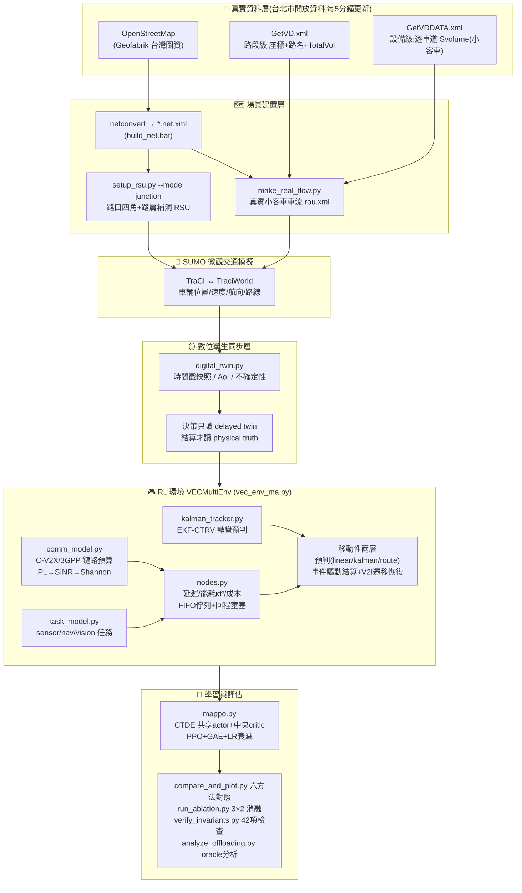
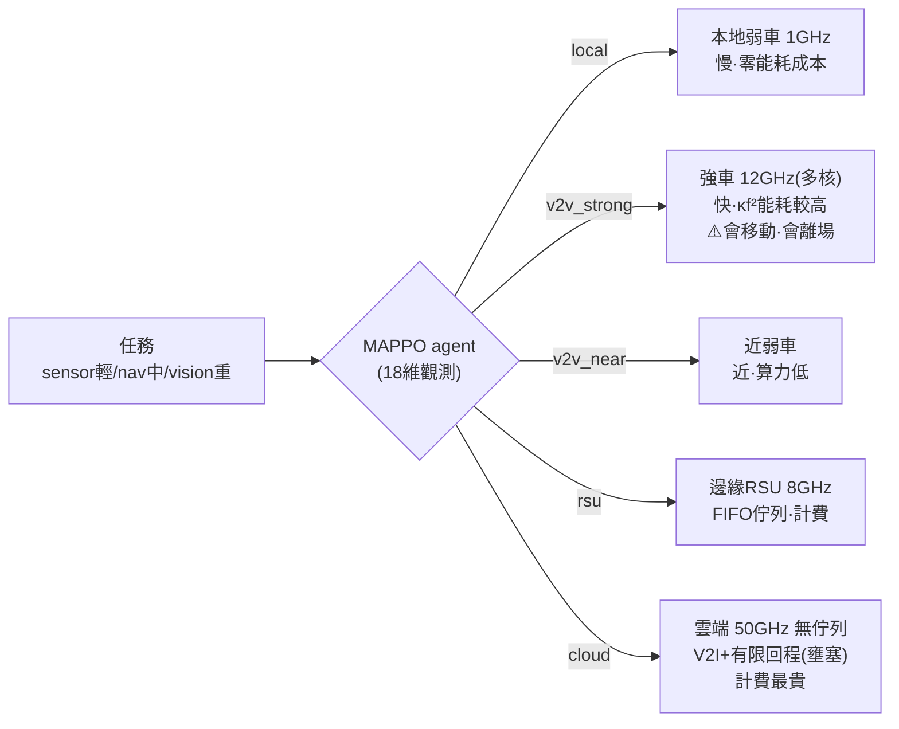

# 數位孿生車聯網運算卸載 — SUMO + 真實台北車流 + MAPPO

以台北市真實路網(和平東路/新生南路)與交控中心即時車流打造數位孿生,
用多智能體強化學習(MAPPO, CTDE)學習「本地 / V2V(強車·近車) / 邊緣 RSU / 雲端」
四層運算卸載決策,在**延遲、能耗、使用成本、deadline、移動性**多重限制下最大化任務成功率。

> 📄 詳細文件:[PROGRESS.md](PROGRESS.md)(進度/參數/待辦) · [COMM_MODEL.md](COMM_MODEL.md)(通訊/移動性模型公式與文獻)

---

## 系統架構



### 三層卸載決策(每個任務 5 選 1)



---

## 完整實驗流程


| 步驟 | 指令 | 產出 |
|---|---|---|
| **1. 路網** | 從 [Geofabrik](https://download.geofabrik.de/asia/taiwan.html) 下載 `taiwan-latest.osm.pbf` → `osmconvert taiwan.pbf -b="西,南,東,北" -o=area.osm` → `build_net.bat area.osm` | `*.net.xml` |
| **2. RSU 佈點** | `python setup_rsu.py --net hepingeast2.net.xml --mode junction --corners 2 --plot` | `rsu.add.xml`、`rsu_positions.json`、佈點圖 |
| **3. 真實車流** | `python make_real_flow.py --net hepingeast2.net.xml --remap` → 用 `vd_debug.add.xml` 在 sumo-gui 校對 | `real_traffic_hep.rou.xml`(小客車)、`vd_sumo_mapping.csv` |
| **4. 場景+驗證** | `heping.sumocfg` 指向 net/rou/rsu → `python verify_invariants.py` | 42 項不變量 PASS |
| **5. 訓練** | `python train_mappo.py --sumo` | `mappo_vec.pt`、多指標收斂 CSV |
| **6. 評估** | `python compare_and_plot.py --sumo`、`python run_ablation.py --sumo --plot` | 對照表/圖、3×2 消融 |

**換路網必知**:RSU 數改變 → 全域狀態維度改變 → **MAPPO 必須重新訓練**;
VD 對應(`vd_sumo_mapping.csv`)綁定路網,`--remap` 會自動偵測重建。

### 和平東路目前的標準流程

主場景由 `scenario_config.py` 明確指定為 `heping`：`heping.sumocfg`、
`hepingeast2.net.xml`、8 個 RSU 與和平東路 VD mapping 共用同一座標系。
舊忠孝路網保留為 `zhongxiao`，但不會再與和平東路的模型或結果檔混用。

```powershell
# 1. 抓一筆官方路段級 VD 快照；正式資料集建議每 300 秒持續保存
& .\.venv\Scripts\python.exe collect_vd.py --scenario heping --count 1
& .\.venv\Scripts\python.exe collect_vd.py --scenario heping --count 0 --interval 300

# 2. 從指定快照建立可重現的靜態一小時交通需求
& .\.venv\Scripts\python.exe build_scenario.py --scenario heping `
  --snapshot traffic_data\heping\VD_SECTION_20260714_122839.xml `
  --output real_traffic_hep.rou.xml

# 3. 基本驗證與靜態場景預覽
& .\.venv\Scripts\python.exe verify_invariants.py
& "C:\Program Files (x86)\Eclipse\Sumo\bin\sumo-gui.exe" -c heping.sumocfg

# 4. 正式、可重現的 replay 訓練與同條件評估
& .\.venv\Scripts\python.exe train_mappo.py --sumo --scenario=heping `
  --vd-mode=replay --twin-quality --seed=0
& .\.venv\Scripts\python.exe compare_and_plot.py --sumo --scenario=heping `
  --vd-mode=replay --twin-quality
& .\.venv\Scripts\python.exe visualize_dt.py --sumo --scenario heping `
  --vd-mode replay --twin-quality --tau 2 --ticks 200

# 5. 即時展示（需網路；不建議作為論文訓練資料）
& .\.venv\Scripts\python.exe visualize_dt.py --sumo --scenario heping `
  --vd-mode live --twin-quality --tau 2 --ticks 200
```

`replay` 每 300 個模擬秒換下一筆封存快照；`live` 每 300 秒牆鐘時間更新。
兩者都透過環境既有的同一條 TraCI 連線注入車輛，並覆寫靜態 route file，
因此不會同時啟動第二個 SUMO 或把靜態與動態需求重複相加。預期的正式模型名稱為
`mappo_heping_replay_tq_vec.pt`；結果檔也會包含 `_heping_replay_tq` 後綴。
和平東路三個號誌採固定時制，避免 SUMO actuated 控制缺少 detector 時的警告，也讓
不同 seed 的號誌控制條件一致；本研究不把號誌最佳化納入動作空間。

---

## 模組一覽

| 模組 | 職責 |
|---|---|
| `infra_config.py` | 全部物理參數單一來源:算力/能耗κf²/覆蓋/頻寬/回程容量/計費 |
| `comm_model.py` | C-V2X 鏈路預算(5.9GHz/23dBm/3GPP路損→SINR→Shannon)、contact time |
| `task_model.py` | 三類任務(資料量/運算量/deadline)、Poisson 到達 |
| `nodes.py` | 延遲分解、κf² 能耗、pay-per-use 成本、FIFO 佇列、回程壅塞、sojourn 約束 |
| `kalman_tracker.py` | EKF-CTRV:僅用 BSM 觀測估轉彎率 ω → 預測連線壽命(可部署層) |
| `digital_twin.py` | 延遲快照、時間戳、AoI與不確定性；隔離孿生觀測和物理真值 |
| `vec_env_ma.py` | 多智能體環境、可行動作遮罩、事件驅動結算、V2I遷移恢復、換手 |
| `mappo.py` / `train_mappo.py` | Masked CTDE MAPPO、GAE、LR 衰減、完整 checkpoint metadata |
| `setup_rsu.py` | RSU 佈點:junction(路口四角+路肩)/greedy 兩模式,自適應數量 |
| `collect_vd.py` / `build_scenario.py` | 封存官方 VD 快照並建立可重現的靜態需求 |
| `vd_provider.py` | 同一 TraCI 連線的 replay/live VD 邊界車流注入、AoI 與錯誤統計 |
| `scenario_config.py` | 路網、RSU、VD mapping、資料集與模型命名的情境隔離 |
| `make_real_flow.py` | 台北 VD 真實車流→SUMO(舊版對應/校對工具) |
| `compare_and_plot.py` | 六方法對照(Local/RSU/Cloud/Random/Greedy/MAPPO)+多指標圖 |
| `run_ablation.py` | 移動性消融:預判{linear,kalman,route}×恢復{fail,v2i} |
| `verify_invariants.py` | 42 項物理／孿生／場景不變量迴歸測試 |
| `analyze_offloading.py` | 單任務 oracle:各層何時勝出、交叉點、Pareto 圖 |

---

## 方法亮點(與文獻的差異)

1. **真實資料數位孿生**:台北交控中心即時 VD 車流(非合成流量)校正 SUMO 場景。
2. **三層異質完整成本模型**:κf² 分層能耗、pay-per-use 成本、有限回程壅塞 —— 三股力自然抑制「無腦上雲」。
3. **移動性閉環(主要貢獻)**:`預判(admission) → 執行期真實位置驗證(事件驅動) → V2I 遷移恢復`,預判器三級階梯 **linear(naive) → kalman(EKF-CTRV,僅 BSM 可觀測量,可部署) → route(V2X 意圖分享,oracle 上界)**。
4. **MAPPO 工程**:變動 agent 數、團隊獎勵、延遲信用結算(settle-delta)。

### Correctness-first 重構說明

- 決策候選、距離、覆蓋與 contact feature 一律取自帶時間戳的 twin snapshot；
  SUMO/MockWorld 即時狀態只用於實際執行與完成時刻結算。
- MAPPO 使用 action mask 排除孿生視角中不存在的強車、鄰車與 RSU；
  contact-time 風險仍留給 admission control 與策略學習。
- `--twin-quality` 會在觀測與中央狀態加入 AoI、位置不確定性代理值，需重新訓練。
- 舊 `--ippo` 實際為共享 actor + 局部 critic 的資訊消融，現改稱
  `--local-critic`／LocalCriticPPO；舊參數只保留為相容別名。

```powershell
python verify_invariants.py
python train_mappo.py --sumo --twin-quality --seed=0
python compare_and_plot.py --sumo --twin-quality
python run_seeds.py --sumo --twin-quality --seeds 5
python run_seeds.py --sumo --twin-quality --seeds 5 --local-critic
python run_dt_delay.py --sumo --twin-quality --plot
```

**Mock 驗證成果**:MAPPO 與最強 baseline(Greedy)成功率打平(80.7% vs 80.9%),
**能耗低 34%、使用成本僅 1/270**;學會分流(輕任務本地、重任務強車/邊緣)。
SUMO 正式數據待和平東路場景重訓。

## 資料來源

- 路網:OpenStreetMap(Geofabrik 台灣圖資)→ netconvert
- 車流:臺北市政府交通局交控中心即時交通資訊(Open Data,5 分鐘更新)
  - `GetVD.xml.gz` 路段級(座標/路名/TotalVol)，目前 replay/live 的正式輸入
  - `GetVDDATA.xml.gz` 設備級(逐車道 S/M/L 分車種流量)→ 僅取小型客車;
    路段級無分車種時以全市設備級比例(實測 ≈0.75)換算
- 轉向分配:無真實轉向資料,均分可達邊界出口(論文聲明之假設)
